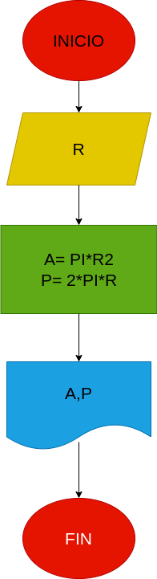

# Ejercicioo N°1

## Calcular el area y el perimetro de un circulo de radio R

# AALISIS

Variable de entrada (imput)

R: Radio del circulo

Variables de roceso y salida (processsing, estorage, output)

A:  Area del circulo=PI*R2

P: Perimetro del circulo=2*PI*R

# DISEÑO

# CONSTRUCCION
 

